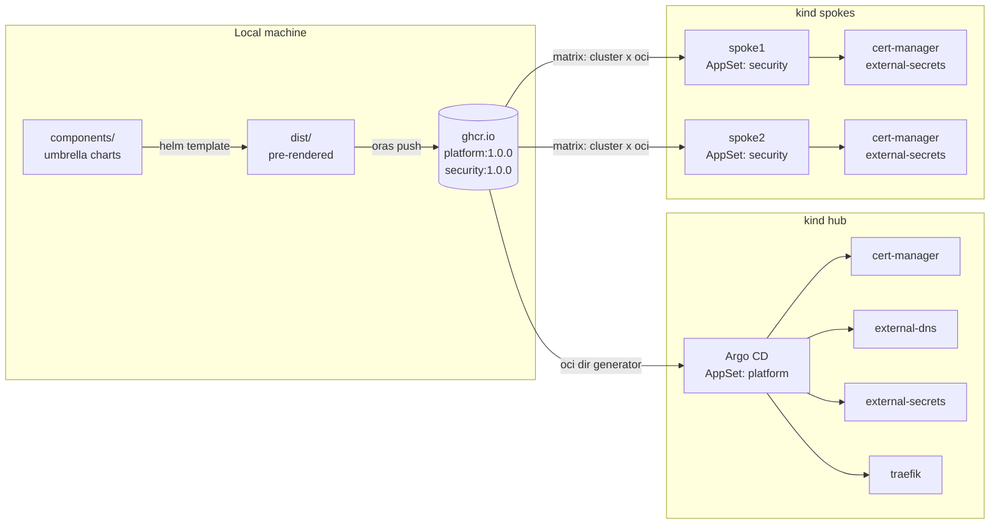

# argocd-oci-generator-demo

Demo of the [Argo CD OCI generator](https://argo-cd.readthedocs.io/en/release-3.6/operator-manual/applicationset/Generators-OCI/): pre-rendered platform components distributed as versioned OCI artifacts and deployed by ApplicationSets.

## Bundles

| Artifact | Contents | Deployed to |
|---|---|---|
| `ghcr.io/robinlieb/argocd-oci-generator-demo/platform:1.0.0` | cert-manager, external-dns, external-secrets, traefik | hub (OCI dir generator) |
| `ghcr.io/robinlieb/argocd-oci-generator-demo/security:1.0.0` | cert-manager, external-secrets | spokes (Matrix: cluster × OCI) |

Each `components/<name>/` is a Helm umbrella chart wrapping the upstream chart with a pinned version. `hack/render.sh` pre-renders them into a flat manifest per component; `hack/publish.sh` pushes each bundle as a single-layer OCI artifact.
